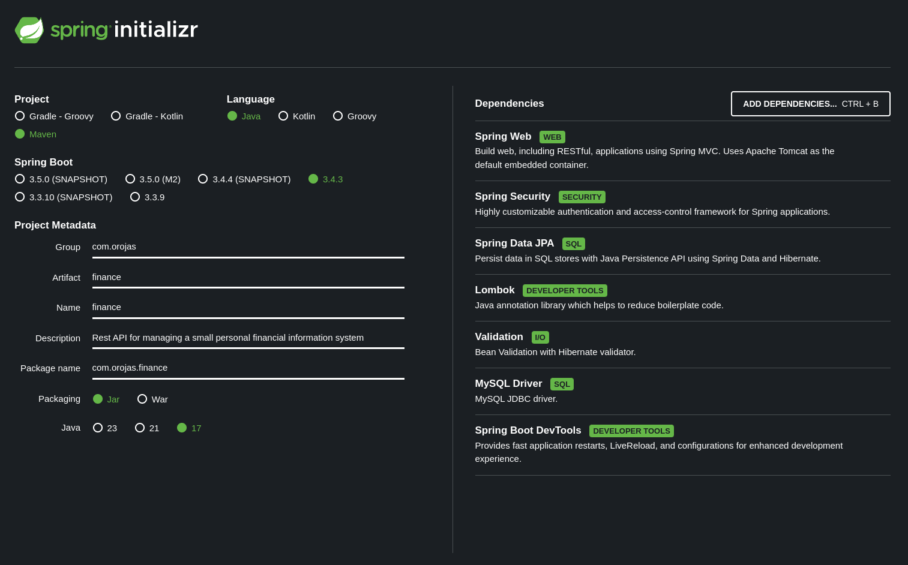

# 1. Configuración inicial del proyecto

## 1.1. Crear un proyecto Spring Boot

Primero vamos a crear el proyecto, para esto nos ubicamos en un navegador de internet, luego procedemos a ir a 
la página [Spring Initializr](https://start.spring.io/).

## 1.2. Configurar el proyecto:

Una vez en el formulario, debemos diligenciar la siguiente información:

  * Project: ***Maven***
  * Language: ***Java***
  * Spring Boot: ***3.4.3*** 
  * Project Metadata: 

    | Clave        | Valor                                                               |
    |--------------|---------------------------------------------------------------------|
    | Group        | com.orojas                                                          |
    | Artifact     | finance                                                             |
    | Name         | finance                                                             |
    | Description  | Rest API for managing a small personal financial information system |
    | Package name | com.orojas.finance                                                  |
    | Packaging    | Jar                                                                 |
    | Java         | 17                                                                  |

## 1.3. Agregue las siguientes dependencias:

* Spring Web            Version: 3.4.3
* Spring Security       Version: 3.4.3
* Spring Data JPA       Version: 3.4.3
* MySQL Driver          Version: 9.1.0
* Validation            Version: 3.4.3
* Lombok                Version: 1.18.36
* Spring Boot DevTools  Version: 3.4.3

A continuación podemos ver la imagen de ***Spring Initializr*** ya diligenciada:



## 1.4. Descargar


Haz clic en el botón `GENERATE` para descargar el proyecto, el cual está ubicado en la parte inferior del formulario, 
extraer el archivo ***zip*** y abrirlo en tu IDE.

***Spring Initializr*** te ayuda a generar un proyecto ***Spring Boot*** pre-configurado con todas las dependencias 
necesarias, para que no tengas que configurarlas manualmente. Este paso simplifica el proceso de configuración y 
te permite empezar a programar más rápido.

## 1.5. Control de versiones

Configuración inicial de un repositorio local de Git.

``` bash
git init
git add .
git commit -m "Add initial files"
git switch -c develop
git switch -c feat/config
```

# 2. Configuración

## 2.1. Deshabilitar Spring Security

Deshabilitamos Spring Security para permitir el desarrollo de las primeras funciones, logramos esto comentando 
la dependencia en el archivo ***pom.xml***.

Y finalmente sincronizamos los cambios en Maven

``` xml
<!--		TODO  **ORM**  We disabled Spring Security to allow development of the first features. -->
<!--		<dependency>-->
<!--			<groupId>org.springframework.boot</groupId>-->
<!--			<artifactId>spring-boot-starter-security</artifactId>-->
<!--		</dependency>-->
```
## 2.2. Instalación de MapStruct

Instalamos ***MapStruct*** adicionando la dependencia en el archivo pom.xml, ya que ***MapStruct*** y 
***Lombok*** tienen conflictos debemos tener especial cuidado con sus versiones. Y finalmente sincronizamos 
los cambios en Maven.

A continuación los cambios en el archivo ***pom.xml***.

``` xml
    <properties>
        <java.version>17</java.version>
        <org.mapstruct.version>1.6.3</org.mapstruct.version>
        <org.lombok.version>1.18.32</org.lombok.version>
        <org.lombok-mapstruct-binding.version>0.2.0</org.lombok-mapstruct-binding.version>
    </properties>
```

``` xml
    <dependency>
        <groupId>org.projectlombok</groupId>
        <artifactId>lombok</artifactId>
        <version>${org.lombok.version}</version>
        <scope>provided</scope>
    </dependency>
    
    <dependency>
        <groupId>org.mapstruct</groupId>
        <artifactId>mapstruct</artifactId>
        <version>${org.mapstruct.version}</version>
    </dependency>
```

``` xml
                <annotationProcessorPaths>
                    <path>
                        <groupId>org.projectlombok</groupId>
                        <artifactId>lombok</artifactId>
                        <version>${org.lombok.version}</version>
                    </path>
                
                    <path>
                        <groupId>org.mapstruct</groupId>
                        <artifactId>mapstruct-processor</artifactId>
                        <version>${org.mapstruct.version}</version>
                    </path>
                
                    <path>
                        <groupId>org.projectlombok</groupId>
                        <artifactId>lombok-mapstruct-binding</artifactId>
                        <version>${org.lombok-mapstruct-binding.version}</version>
                    </path>
                </annotationProcessorPaths>
```

## 2.3. Instalación de la Base de Datos MySQL

En el ambiente del desarrollador utilizaremos MySQL en un contenedor Docker, :
*
* Prerrequisito tener instalado ***Docker***.
* En un directorio aparte, creamos el archivo ***docker-compose.yaml***.
* El contenido del archivo debe ser el que vemos abajo.
* Nos ubicamos en este directorio y ejecutamos el comando `docker-compose up -d`.
* Verificamos su ejecución con el comando `docker ps`.

``` shell
# To Run    docker-compose up -d
# To List   docker ps
# Remove    docker rm -f <ids>

services:
  database:
    container_name: mysql
    image: mysql:latest
    volumes: 
      - ./data:/var/lib/mysql
    restart: always
    ports: 
      - '3306:3306'
    environment: 
      MYSQL_ROOT_PASSWORD: <RootPassword>
      MYSQL_DATABASE: finance_db
      MYSQL_USER: finance_user
      MYSQL_PASSWORD: <userPassPassword>
```

## 2.4. Crear una base de datos ***MySQL***

Abre ***MySQL*** Workbench (o la línea de comandos de ***MySQL***) y ejecuta el siguiente comando ***SQL***
para crear una nueva base de datos:

``` bash
CREATE DATABASE finance_db;
```

Esto creará una base de datos llamada ***finance_db*** para almacenar los datos de la aplicación.

## 2.5. Configurar MySql

En el archivo ***src/main/resources/application.properties***, agregue la siguiente
configuración para conectar su aplicación ***Spring Boot*** con ***MySQL***:

``` bash
# MySQL Database configuration
spring.datasource.url=${DB_HOST}
spring.datasource.username=${DB_USER}
spring.datasource.password=${DB_PASSWORD}
spring.datasource.driver-class-name=com.mysql.cj.jdbc.Driver

# JPA and Hibernate configuration
spring.jpa.generate-ddl=true
spring.jpa.hibernate.ddl-auto=create
spring.jpa.database-platform=org.hibernate.dialect.MySQLDialect
# spring.jpa.show-sql=true
# logging.level.org.hibernate.SQL=debug
```

Note que debe configurar las variables de entorno: DB_HOST, DB_USER y DB_PASSWORD;
con los valores que correspondan a su base de datos.

## 2.6. Configurar application.properties

En el archivo ***src/main/resources/application.properties***, adicionamos las siguientes
configuraciones:

* Configuración del nombre de la aplicación
* Agregar el **context path**
* Configuración de logger

``` bash
# App configuration
spring.application.name=finance-app

# The context path
server.servlet.context-path=/api/v1

# Login configuration
spring.output.ansi.enabled=ALWAYS
logging.level.com.orojas=trace
logging.file.name=finance.log

# MapStruct configuration
spring.jackson.default-property-inclusion=non_null
spring.jackson.property-naming-strategy=SNAKE_CASE

# MySQL Database configuration
spring.datasource.url=${DB_HOST}
spring.datasource.username=${DB_USER}
spring.datasource.password=${DB_PASSWORD}
spring.datasource.driver-class-name=com.mysql.cj.jdbc.Driver

# JPA and Hibernate configuration
spring.jpa.generate-ddl=true
spring.jpa.hibernate.ddl-auto=create
spring.jpa.database-platform=org.hibernate.dialect.MySQLDialect
# spring.jpa.show-sql=true
# logging.level.org.hibernate.SQL=debug
```
